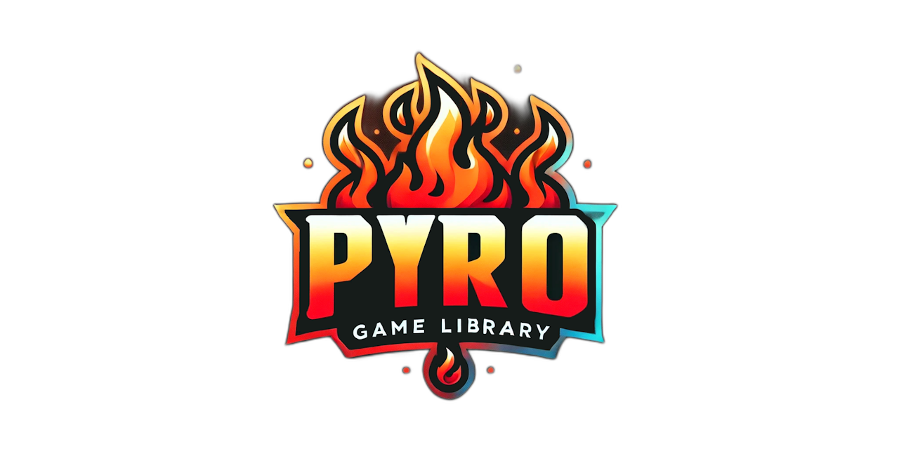

  

### 🔥 Pyro Game Library 🔥  

The **Pyro Game Library** is a modern, lightweight, and feature-rich game development framework designed to empower developers to create 🔄 dynamic and engaging 2D games. Built on a foundation of cutting-edge open-source technologies, Pyro combines flexibility, performance, and simplicity into one powerful, **batteries-included** toolkit. 🔋  

#### ✨ Key Features ✨  

- **📚 Core Libraries**: Powered by the SFML ecosystem via the CSFML API, with **enhanced routines** and **additional features** that make using SFML faster and easier.  
  - **🖼️ Image Support**: Handle a variety of image formats for versatile graphic assets.  
  - **🎵 Higher-Level Audio Engine**: Simplify audio management for music, sound effects, and streaming audio.  
  - **✍️ TrueType Fonts**: Dynamic and scalable font rendering for high-quality text.  
  - **📦 Compression**: Efficient data storage and transfer with integrated zlib.  
  - **📹 Video Playback**: Seamlessly play MPEG-1 videos for cinematic experiences.  

- **📐 Advanced Math Library**: A comprehensive suite of mathematical tools for geometry, transformations, and physics calculations.  

- **💃 Spine 2D Animation Support**: Bring your characters to life with fluid and expressive animations.  

- **🔒 Password-Protected Zipfile Support**: Securely bundle your game assets with encrypted ZIP file support.  

- **🎬 MPEG-1 Video Playback**: Add a touch of Hollywood 🎥 to your games with smooth video integration.  

- **🌙 Full Lua Scripting**: Take control of your game logic with these Lua features:  
  - **🔗 Registration**: Bind custom game functions to Lua with ease.  
  - **📂 Importing**: Load Lua scripts directly into your game.  
  - **📦 Bundling**: Seamlessly package scripts with your game for deployment.  
  - **⚙️ FFI**: Call C libraries or extend functionality natively.  

With **batteries included** 🔋, **enhanced CSFML routines**, and a **higher-level audio engine**, Pyro Game Library is your ultimate toolkit for 2D game development. Whether you’re crafting a retro classic 🎮 or building an innovative 2D experience 🌟, Pyro is here to ignite your creativity! 🚀  

👉 **Start your adventure with Pyro today!** 🌌  

<h5 align="center">

Made with :heart: in Delphi
</h5>
